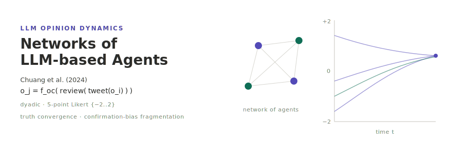

<p align="center"></p>

[English](README.md) | **日本語**

# Simulating Opinion Dynamics with Networks of LLM-based Agents — Chuang et al. (2024)

Chuang et al. (2024)「Simulating Opinion Dynamics with Networks of LLM-based Agents」(*Findings of ACL: NAACL 2024*, 3326–3346; arXiv:2311.09618) の再現実装である．LLM 駆動エージェントの集団をネットワーク上に配置し，各ステップで話者・聴者のペアを一様サンプリングする．話者は自分のスタンスを述べる短い「ツイート」を発話し，聴者はそれを読んで更新後の所感を報告，意見分類器 `f_oc` がその所感を 5 段階リッカート尺度 `o ∈ {−2,−1,0,1,2}` へ写像する．論文の核心的知見は「真実方向への合意へ収束する強い内在バイアス」と，「確証バイアスを注入すると合意が崩れ意見が分断 (fragmentation) する」ことである．本実装はこのコレクション初の **LLM 駆動** 再現であり，決定論的な [socsim](https://github.com/akitenkrad/rs-social-simulation-tools) コアがネットワーク・ペア選択・スケジューリング・メトリクスを担い，非決定的な LLM レイヤを 1 つのメカニズムに閉じ込め，任意クレート `socsim-llm` (プロンプト→応答キャッシュ + `temperature=0` + seed 固定) で擬似決定論化する．

## 二層決定論 (最初に読むこと)

LLM 出力は socsim の bit 再現性の **外側** にある．したがって設計を二層に分ける．

- **決定論的 socsim コア** — ネットワーク生成・話者/聴者サンプリング (`ctx.rng`, ChaCha20)・スケジューリング・メトリクス・収束判定．seed を固定すれば bit 単位で再現する．
- **非決定的 LLM レイヤ** — ツイート生成・所感報告・意見分類．`socsim-llm` の `CachingClient` (`hash(prompt+model)` → 応答キャッシュ)・`temperature=0`・seed 固定で擬似決定論化する．プロバイダ優先順位は **Ollama 第一 → OpenAI フォールバック** で，`socsim-llm` の `FallbackClient` を用いる (自前実装しない)．

再現性の本体はモデルではなく **キャッシュ** である．ウォームキャッシュは同一応答を再生するため，再実行はコスト 0 かつ安定する．各実行は `run_metadata.json` にモデル・endpoint・温度・seed・cache-hit 率を記録する．ローカル既定モデル (`llama3.2`) は論文の `gpt-3.5-turbo` と異なるため，再現目標は **定性的** (合意傾向，Bias `B` の符号，確証バイアス強化に伴う Diversity `D` の単調増大) であり，厳密な数値一致ではない．

## インストール & クイックスタート

```bash
# Rust シミュレーションをビルド (socsim および Ollama+OpenAI バックエンド付き socsim-llm を取得)
cargo build --release

# ローカル Ollama を起動しモデルを取得しておく．例:
#   ollama pull llama3.2:latest
export OLLAMA_HOST=http://localhost:11434
export OLLAMA_MODEL=llama3.2:latest
# 任意の OpenAI フォールバック:
#   export OPENAI_API_KEY=sk-...   OPENAI_MODEL=gpt-4o-mini

# 小規模な実行 (全結合・確証バイアスなし・false フレーミング)
cargo run --release -- run --n-agents 10 --topology full --bias none --framing false --max-steps 100 --seed 42

# Python 可視化ツールをインストール (workspace ルートで)
uv sync

# 直近の実行を可視化 (意見軌跡 + B/D/分散の時系列)
uv run chuang-tools visualize

# 実行設定と LLM メタデータの確認
uv run chuang-tools show-experiment-settings --results-dir results/latest
```

## ドキュメント

- [ユースケース](docs/usecases.ja.md) — 本プロジェクトでできること，および各ドキュメントへの案内．
- [CLI](docs/cli.ja.md) — Rust CLI: `run` / `sweep` サブコマンドとフラグ，LLM 環境変数．
- [可視化](docs/visualization.ja.md) — Python `chuang-tools` と出力の解釈．
- [アーキテクチャ](docs/architecture.ja.md) — リポジトリ構成・二層決定論・socsim/`socsim-llm` 基盤・メカニズム・メトリクス・参考文献．

## スコープ

本リポジトリはネットワーク上の dyadic LLM 意見更新コアモデル，二層 LLM クライアント (Ollama→OpenAI フォールバック + キャッシュ)，意見収束メトリクスを実装し，3 つの Rust サブコマンドと Python ツール群として提供する:

- `run` — 単一設定．`--control no-interaction` アーム (近傍を見ず単独進化) とオフライン `--mock` モードを備える．
- `sweep` — 確証バイアス × フレーミング × トポロジ (`full` / `er` / `ws` / `ba`) の格子走査．
- `reproduce` — 論文の見出し的知見をワンコマンドで再現: bias × control 行列 (無バイアス→真実合意 / 強バイアス→断片化 / 非相互作用統制が社会的影響と LLM 固有のドリフトを分離) と topology 比較を実行し，観測 vs 論文のアンカーを `reproduce_summary.json` に書き出す．
- Python `chuang-tools`: `visualize` / `visualize-sweep` / `show-experiment-settings` / `reproduce` (再現図を描く)．

意見分類器は `reflective` メモリ方式ラベルを持つが，現行の更新経路は上述の `cumulative` メモリを用いる．reflective メモリの要約は拡張点として残している．

## ライセンス

MIT

---
*This file was generated by Claude Code.*
